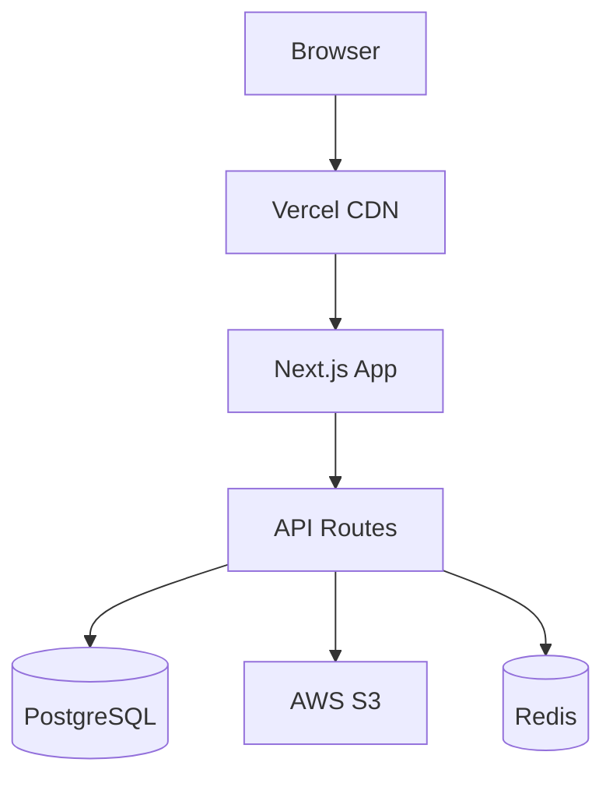
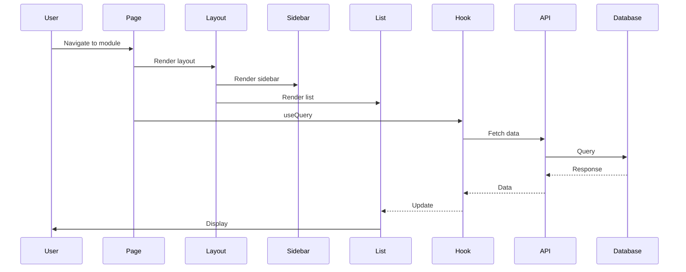

# 🏛️ Architecture BMO

## Vue d'ensemble

BMO suit une architecture **modulaire et évolutive** basée sur Next.js App Router avec des principes Clean Architecture.

## Principes architecturaux

### 1. Séparation des préoccupations

```
Présentation (UI)
    ↓
Logique métier (Hooks)
    ↓
Accès données (API)
    ↓
Données (Database)
```

### 2. Architecture en couches

#### Couche Présentation

```typescript
// Components React
- Layouts (OutlookLike, Dashboard, Calendar)
- Modules (AlertsPage, DemandesPage, etc.)
- UI Components (shadcn/ui)
- Business Components (QuickActionsBar, FilterBar)
```

#### Couche Application

```typescript
// Hooks & State Management
- React Query (cache serveur)
- Zustand (état global)
- React Hook Form (formulaires)
```

#### Couche Domaine

```typescript
// Types & Configs
- Types TypeScript (*.types.ts)
- Configurations modules (*.config.ts)
- Validation schemas (Zod)
```

#### Couche Infrastructure

```typescript
// API & Database
- Next.js API Routes
- Prisma ORM
- PostgreSQL
```

## Patterns de conception

### 1. Module Pattern

Chaque module suit la même structure :

```
module/
├── page.tsx              # Page principale
├── [Module]ListRow.tsx   # Composant ligne liste
├── [Module]DetailPanel.tsx # Panel détail
├── Create[Module]Dialog.tsx # Dialog création
├── use[Module]s.ts       # Hooks data
├── [module].types.ts     # Types
├── [module].config.ts    # Configuration
└── [module].api.ts       # API client
```

### 2. Layout Pattern

Trois layouts réutilisables :

**OutlookLikeLayout** (Triple-pane)

```
┌─────────┬──────────┬─────────┐
│ Sidebar │   List   │ Detail  │
│         │          │         │
│ Nav     │ Items    │ Content │
└─────────┴──────────┴─────────┘
```

**DashboardLayout** (Grid)

```
┌─────────┬─────────────────────┐
│ Sidebar │   Widgets Grid      │
│         │  ┌───┬───┬───┐      │
│ Nav     │  │ 1 │ 2 │ 3 │      │
│         │  ├───┼───┼───┤      │
│         │  │ 4 │ 5 │ 6 │      │
└─────────┴──┴───┴───┴───┘      │
```

**CalendarLayout** (Calendar)

```
┌─────────┬─────────────────────┐
│ Sidebar │   Calendar View     │
│         │   ┌─┬─┬─┬─┬─┬─┬─┐   │
│ Nav     │   │L│M│M│J│V│S│D│   │
│         │   ├─┼─┼─┼─┼─┼─┼─┤   │
│         │   │ │ │ │ │ │ │ │   │
└─────────┴───┴─┴─┴─┴─┴─┴─┴─┘   │
```

### 3. Data Fetching Pattern

```typescript
// React Query pour cache serveur
const { data, isLoading } = useQuery({
  queryKey: ['alerts', filters],
  queryFn: () => api.getAlertes(filters),
  staleTime: 30000,
});

// Mutations avec optimistic updates
const { mutate } = useMutation({
  mutationFn: api.updateAlerte,
  onMutate: async (newData) => {
    // Optimistic update
    queryClient.setQueryData(['alerte', id], newData);
  },
  onError: (err, variables, context) => {
    // Rollback
    queryClient.setQueryData(['alerte', id], context.previousData);
  },
});
```

### 4. Configuration Pattern

Chaque module expose sa configuration :

```typescript
export const alertsModuleConfig: ModuleConfig = {
  id: 'alerts',
  name: 'Alertes',
  layout: 'triple-pane',
  subSidebar: { /* ... */ },
  quickActions: { /* ... */ },
  filterBar: { /* ... */ },
};
```

## Flux de données

### Lecture (Query)

```
User Action
    ↓
React Component
    ↓
useQuery Hook
    ↓
API Client
    ↓
Next.js API Route
    ↓
Prisma ORM
    ↓
PostgreSQL
    ↓
← Response
    ↓
React Query Cache
    ↓
Component Re-render
```

### Écriture (Mutation)

```
User Action
    ↓
Form Submit
    ↓
useMutation Hook
    ↓
Optimistic Update (UI)
    ↓
API Client
    ↓
Next.js API Route
    ↓
Validation (Zod)
    ↓
Prisma ORM
    ↓
PostgreSQL
    ↓
← Response
    ↓
Cache Invalidation
    ↓
Refetch Data
```

## État global

### Zustand Stores

```typescript
// Selection store (multi-sélection)
const useSelectionStore = create((set) => ({
  selectedIds: [],
  toggleSelection: (id) => { /* ... */ },
}));

// UI store (panels, dialogs)
const useUIStore = create((set) => ({
  detailPanelOpen: false,
  openDetailPanel: () => { /* ... */ },
}));

// Offline store (actions en attente)
const useOfflineStore = create((set) => ({
  pendingActions: [],
  addPendingAction: (action) => { /* ... */ },
}));
```

## Sécurité

### Authentication Flow

```
Login Request
    ↓
NextAuth.js
    ↓
Credentials Provider
    ↓
Validate User (Database)
    ↓
Generate JWT
    ↓
Session Cookie (httpOnly, secure)
    ↓
Protected Routes (Middleware)
```

### Authorization

```typescript
// Middleware
export function middleware(request: NextRequest) {
  const token = await getToken({ req: request });

  if (!token) {
    return NextResponse.redirect('/login');
  }

  // Role-based access
  if (request.url.includes('/admin') && token.role !== 'admin') {
    return NextResponse.redirect('/unauthorized');
  }
}
```

## Performance

### Optimisations

1. **Code Splitting**

```typescript
// Dynamic imports
const HeavyComponent = dynamic(() => import('./Heavy'), {
  loading: () => <Loading />,
});
```

2. **Virtualisation**

```typescript
// Liste virtualisée pour >50 items
// @tanstack/react-virtual ou react-window
```

3. **Caching**

```typescript
// Stale-while-revalidate
queryClient.setQueryDefaults(['alerts'], {
  staleTime: 30000,
  cacheTime: 300000,
});
```

4. **Image Optimization**

```typescript
// Next.js Image component
import Image from 'next/image';
```

## Scalabilité

### Horizontal Scaling

```
Load Balancer (Nginx)
    ↓
┌─────────┬─────────┬─────────┐
│ App 1   │ App 2   │ App 3   │
└─────────┴─────────┴─────────┘
    ↓          ↓         ↓
Database Pool (PgBouncer)
    ↓
PostgreSQL Primary
    ↓
PostgreSQL Replicas
```

### Caching Strategy

```
Browser Cache
    ↓
CDN (Vercel Edge)
    ↓
React Query Cache
    ↓
Redis Cache (optionnel)
    ↓
Database
```

## Monitoring

### Observabilité

```
Application
    ↓
├─ Logs → Logtail
├─ Errors → Sentry
├─ Metrics → Vercel Analytics
└─ Traces → OpenTelemetry
```

## Diagrammes

### Architecture globale



### Module lifecycle


